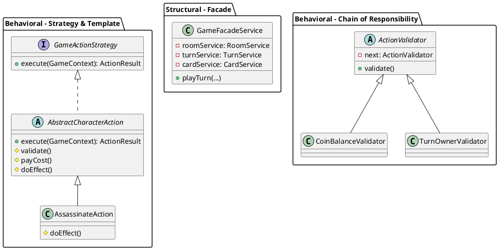

# Design Patterns ใน Game Engine - EternalClash2

เอกสารนี้รวบรวม Design Patterns ที่ใช้ในการออกแบบ Game Engine ของ EternalClash2 พร้อมอธิบายเหตุผลและปัญหาที่ช่วยแก้ไข

## 1. Behavioral Patterns

| Pattern | ปัญหาที่แก้ (ถ้าไม่ใช้จะเกิดอะไรขึ้น) | คลาสที่ใช้งาน |
|---------|---------------------------------|---------------|
| **Strategy** | ถ้าไม่ใช้ จะต้องใช้ `if-else` หรือ `switch-case` เช็คประเภท action บวมเต่งใน `GameService` และเวลาเพิ่มการ์ดใหม่ ต้องมาแก้โค้ดเดิม ผิดหลัก OCP | `GameActionStrategy`, `IncomeAction`, `CoupAction`, etc. |
| **State** | ถ้าไม่ใช้ ต้องมี flag boolean ยิบย่อย (เช่น `isWaitingForChallenge`, `isBlocking`) เช็คกันวุ่นวาย บั๊กง่าย State Pattern คุมพฤติกรรมแต่ละ Phase ได้อย่างชัดเจน | `GamePhase` (interface), `ChallengeWindowState`, `ResolutionState`, etc. |
| **Observer** | ถ้าไม่ใช้ Business logic ต้องไปผูกติดกับ Notification, WebSocket, UpdateStats ทำให้คลาสแน่นและ coupling สูง | Spring `ApplicationEvent`, `CardRevealedEvent`, `WebSocketPushListener` |
| **Chain of Responsibility** | ถ้าไม่ใช้ โค้ดตรวจสอบเงื่อนไข (Validate) จะกองรวมกันใน method เดียวเป็นร้อยบรรทัด ยากต่อการนำไปใช้ซ้ำและทดสอบ | `ActionValidator`, `TurnOwnerValidator`, `CoinBalanceValidator` |
| **Template Method** | ถ้าไม่ใช้ Action คล้ายๆ กันจะต้องเขียนโค้ด validate/payCost ซ้ำซ้อน Template Method ช่วยบังคับโครงสร้างและให้ subclass override เฉพาะผลลัพธ์ | `AbstractCharacterAction`, `AssassinateAction` |

## 2. Creational Patterns

| Pattern | ปัญหาที่แก้ (ถ้าไม่ใช้จะเกิดอะไรขึ้น) | คลาสที่ใช้งาน |
|---------|---------------------------------|---------------|
| **Factory Method** | ถ้าไม่ใช้ โค้ดต้อง `new` Object เอง ทำให้ยึดติดกับ implementation และไม่สามารถ inject dependencies ของ Spring เข้าไปใน Action ได้ | `GameActionStrategyFactory` |
| **Builder** | ถ้าไม่ใช้ ต้องส่ง parameter เรียงกันยาวเหยียดใน Constructor (Telescoping Constructor) ซึ่งอ่านยากและเสี่ยงสลับตำแหน่ง | `GameStateResponse` (`@Builder`) |
| **Singleton** | ถ้าไม่ใช้ Service จะถูกสร้างใหม่ทุกครั้งที่เรียก เปลือง memory (Spring เป็น Singleton Scope โดยปริยาย ต่างจาก GoF ตรงที่ Scope คือ per ApplicationContext ไม่ใช่ per Classloader) | `GameActionService`, `GameFacadeService` |

## 3. Structural Patterns

| Pattern | ปัญหาที่แก้ (ถ้าไม่ใช้จะเกิดอะไรขึ้น) | คลาสที่ใช้งาน |
|---------|---------------------------------|---------------|
| **Facade** | ถ้าไม่ใช้ Controller ต้องเรียก Service 4-5 ตัวเพื่อประกอบการทำงานเดียว ทำให้ Controller รับภาระมากไป | `GameFacadeService` |
| **Adapter** | ถ้าไม่ใช้ Business logic ต้องผูกติดกับ `SecureRandom` โดยตรง ทำให้ทดสอบ (Test) ไม่ได้เพราะสุ่มการ์ดเดาไม่ได้ | `DeckShuffler` (interface), `SecureRandomAdapter` |

## Class Diagram (PlantUML)

